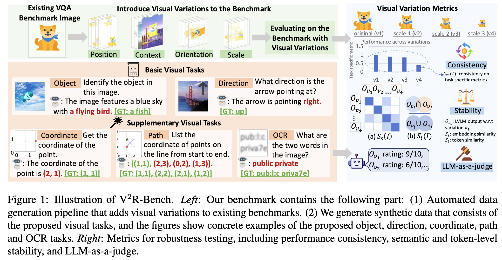
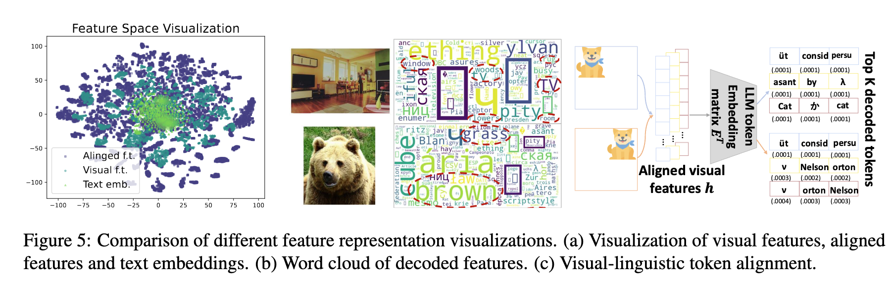
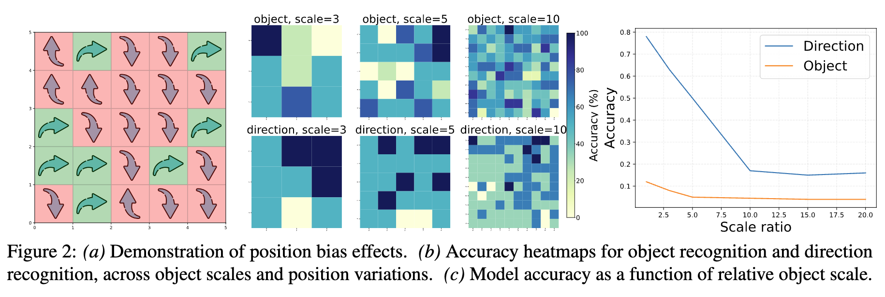

# V2R-Bench: Holistically Evaluating LVLM Robustness to Fundamental Visual Variations

## Motivation

Large Vision Language Models (LVLMs) have demonstrated remarkable capabilities across a spectrum of vision-language tasks. However, a critical aspect often remains underexplored: their robustness to fundamental visual variations. Objects in natural scenes inevitably exhibit changes in position, scale, orientation, and context due to varying viewpoints, distances, and environments.
The inconsistency in model performance when faced with these common variations poses significant challenges for real-world deployment. We introduces V2R-Bench to systematically investigate and quantify these vulnerabilities on the component level.

## Framework

V2R-Bench provides a comprehensive framework for evaluating LVLM robustness, encompassing automated dataset generation, robustness evaluation and component analysis.



1. **Automated Variation Generation**

    We propose an automated data generation pipeline that systematically introduces four key visual variations to input images:
    - Position (Shifts in spatial location)
    - Scale (Changes in object size)
    - Orientation (Rotations & deviations)
    - Context (Alterations in surroundings)
    
    This pipeline can be applied to both synthetic scenes and existing benchmark datasets.

2. **Evaluation Tasks & Datasets**

    The framework utilizes two main categories of tasks:
    - **Basic Visual Tasks:** Controlled experiments focusing on fundamental capabilities like object recognition (e.g., "Identify the object") and direction recognition (e.g., "What direction is the arrow pointing?").
    - **Extended Benchmarks:** Applying the visual variations to existing Visual Question Answering (VQA) benchmarks, ensuring ground-truth validity is preserved.

    The final evaluation datasets comprise a total of <span style="color:blue">428K images</span>.

3. **Evaluation Metrics**

    To thoroughly assess robustness, V2R-Bench employs several metrics:

    - **Performance Consistency ($C_m$):** Measures how well a model maintains its task-specific performance (e.g., accuracy) across the introduced visual variations.
    - **Output Stability ($S_s, S_t$):** Evaluates the consistency of model-generated outputs at both semantic (embedding similarity) and token (Jaccard similarity) levels when inputs are varied.
    - **LLM-as-a-Judge:** Leverages a powerful LLM to provide qualitative assessments of LVLM outputs under visual variations, emulating human judgment.

## Component-Level Diagnosis & Analysis
To understand the root causes of the observed vulnerabilities, the paper conducts a systematic component-level analysis of typical LVLM architectures. This involves dissecting the contributions of the <span style="color:red">vision encoder</span>, the <span style="color:red">multimodal projector</span>, and the <span style="color:red">language model</span>.

A key innovation is a novel visualization technique that reconstructs language tokens from aligned visual features. This provides interpretable insights into:

- How language models interpret the aligned visual features.
- The semantic robustness of these aligned features when subjected to visual variations.

The analysis reveals that the <span style="color:red">multimodal projector</span> is a primary bottleneck. Significant visual information loss occurs during the projection from visual features to the language embedding space, and the resulting aligned features often lack adequate alignment with the language model's own embedding space.



## Main Findings

The extensive evaluation of 21 LVLMs using V2R-Bench yielded several insights:



- <span style="color:green">**Surprising Vulnerability**</span>: Even state-of-the-art LVLMs, excelling in complex vision-language tasks, exhibit significant performance degradation on simple tasks like object recognition when faced with basic visual variations.

- <span style="color:green">**Counter-Intuitive Position Bias**</span>: Models often show higher accuracy for objects in peripheral regions of an image rather than the center, contradicting theories of effective receptive fields.

- <span style="color:green">**Human-like Visual Acuity Threshold**</span>: Model reliability decreases as object scale diminishes, stabilizing below a critical size threshold, analogous to human visual acuity limits.

- <span style="color:green">**Selective Orientation Robustness**</span>: LVLMs demonstrate varied sensitivity to object orientation, performing robustly for some angles but failing significantly for others.

- <span style="color:green">**Contextual Over-reliance**</span>: Models frequently ground predictions on visual contextual inference rather than direct, faithful perception of the target object.

- <span style="color:green">**Root Causes Identified**</span>:
    - Inadequate Multimodal Alignment: The primary factor, leading to unstable visual representations and poor semantic alignment with the language model.
    - Error Accumulation in Pipeline Architectures: Sequential processing in typical LVLMs (vision encoder → projector → LLM) tends to amplify errors.

- <span style="color:green">**Architectural Deficiencies**</span>: Complementary experiments with synthetic training data suggest these vulnerabilities are fundamentally rooted in architectural design choices rather than mere data limitations.

## Example Usage

```
git clone https://github.com/toward-agi/Visual-Variations-Robustness.git
cd Visual-Variations-Robustness
```

### Dataset generation

The synthetic data can be obtained as follows. Taking the coordinate dataset as an example:

```
python dataset_generation/coordinate.py
```

In `eval_utils/` provides evaluation functions to the model prediction.

In `component_analysis/` we provide scripts for the linear probing experiments of the model components (i.e. vision encoder, mm-projector).

## Citation
This paper is accepted by ACL 2025 (Findings).

For full detailed, please refer to [our paper](https://arxiv.org/abs/2504.16727).

```
@misc{fan2025v2rbenchholisticallyevaluatinglvlm,
      title={V$^2$R-Bench: Holistically Evaluating LVLM Robustness to Fundamental Visual Variations}, 
      author={Zhiyuan Fan and Yumeng Wang and Sandeep Polisetty and Yi R. Fung},
      year={2025},
      eprint={2504.16727},
      archivePrefix={arXiv},
      primaryClass={cs.CV},
      url={https://arxiv.org/abs/2504.16727}, 
}
```